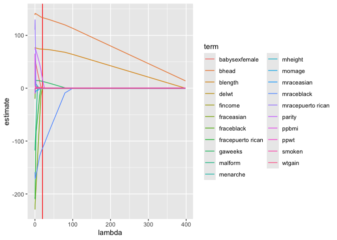
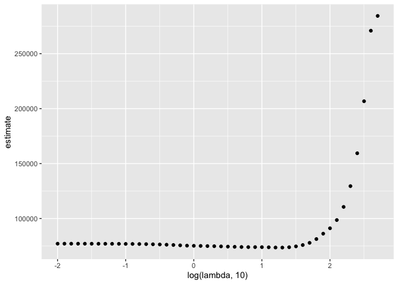
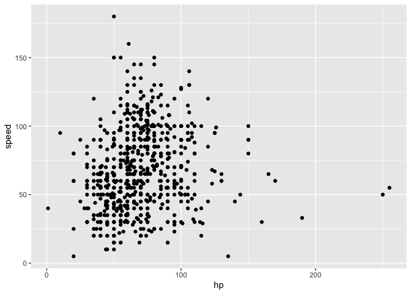
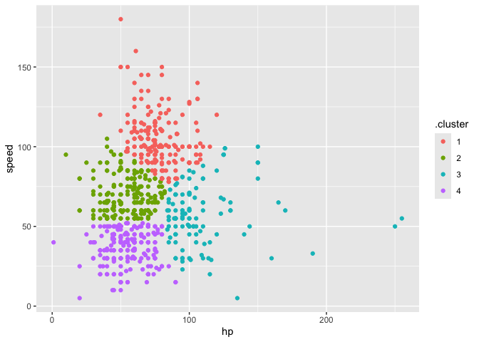

Statistical Learning
================
Soomin You
2024-11-21

Load key packages.

``` r
library(tidyverse)
```

    ## ── Attaching core tidyverse packages ──────────────────────── tidyverse 2.0.0 ──
    ## ✔ dplyr     1.1.4     ✔ readr     2.1.5
    ## ✔ forcats   1.0.0     ✔ stringr   1.5.1
    ## ✔ ggplot2   3.5.1     ✔ tibble    3.2.1
    ## ✔ lubridate 1.9.3     ✔ tidyr     1.3.1
    ## ✔ purrr     1.0.2     
    ## ── Conflicts ────────────────────────────────────────── tidyverse_conflicts() ──
    ## ✖ dplyr::filter() masks stats::filter()
    ## ✖ dplyr::lag()    masks stats::lag()
    ## ℹ Use the conflicted package (<http://conflicted.r-lib.org/>) to force all conflicts to become errors

``` r
library(glmnet)
```

    ## Loading required package: Matrix
    ## 
    ## Attaching package: 'Matrix'
    ## 
    ## The following objects are masked from 'package:tidyr':
    ## 
    ##     expand, pack, unpack
    ## 
    ## Loaded glmnet 4.1-8

``` r
set.seed(1031)
```

## Try Lasso!!!

import and clean birthweight data

``` r
bwt_df = 
  read_csv("./data/birthweight.csv") |>
  janitor::clean_names() |>
  mutate(
    babysex = case_match(babysex, 
                 1 ~ "male", 
                 2 ~ "female"),
    babysex = fct_infreq(babysex), 
    frace = case_match(frace, 
                 1 ~ "white", 
                 2 ~ "black", 
                 3 ~ "asian", 
                 4 ~ "puerto rican", 
                 8 ~ "other"), 
    frace = fct_infreq(frace), 
    mrace = case_match(mrace, 
                 1 ~ "white", 
                 2 ~ "black", 
                 3 ~ "asian", 
                 4 ~ "puerto rican", 
                 8 ~ "other"), 
    mrace = fct_infreq(mrace)
  ) |> 
  sample_n(200)
```

    ## Rows: 4342 Columns: 20
    ## ── Column specification ────────────────────────────────────────────────────────
    ## Delimiter: ","
    ## dbl (20): babysex, bhead, blength, bwt, delwt, fincome, frace, gaweeks, malf...
    ## 
    ## ℹ Use `spec()` to retrieve the full column specification for this data.
    ## ℹ Specify the column types or set `show_col_types = FALSE` to quiet this message.

Construct inputs for `glmnet`

``` r
x = model.matrix(bwt ~ ., data = bwt_df)[, -1]
y = bwt_df |> pull(bwt)
```

Fit lasso for several lambdas

``` r
lambda = 10^seq(-2, 2.75, by = 0.1)

lasso_fit = 
  glmnet(x = x, y = y, lambda = lambda)

lasso_cv = 
  cv.glmnet(x = x, y = y, lambda = lambda)

lambda_opt = lasso_cv[["lambda.min"]]
```

Usual lasso plot

``` r
lasso_fit |>
  broom::tidy() |>
  filter(term != "(Intercept)") |>
  select(term, lambda, estimate) |> 
  complete(term, lambda, fill = list(estimate = 0)) |>
  ggplot(aes(x = lambda, y = estimate, group = term, color = term)) + 
  geom_vline(xintercept = lambda_opt, color = "red") +
  geom_line()
```

<!-- -->

``` r
final_lasso_fit = 
  glmnet(x = x, y = y, lambda = lambda_opt) 

final_lasso_fit |>
  broom::tidy()
```

    ## # A tibble: 8 × 5
    ##   term         step  estimate lambda dev.ratio
    ##   <chr>       <dbl>     <dbl>  <dbl>     <dbl>
    ## 1 (Intercept)     1 -5625.      20.0     0.759
    ## 2 bhead           1   134.      20.0     0.759
    ## 3 blength         1    73.8     20.0     0.759
    ## 4 delwt           1     0.392   20.0     0.759
    ## 5 gaweeks         1    12.9     20.0     0.759
    ## 6 mraceblack      1  -114.      20.0     0.759
    ## 7 parity          1    17.5     20.0     0.759
    ## 8 wtgain          1     0.967   20.0     0.759

Look at CV results.

``` r
lasso_cv |>
  broom::tidy() |>
  ggplot(aes(x = log(lambda, 10), y = estimate)) + 
  geom_point()
```

<!-- -->

## Cluster pokemons

``` r
pokemon_df = 
  read_csv("./data/pokemon.csv") |>
  janitor::clean_names() |>
  select(hp, speed)
```

    ## Rows: 800 Columns: 13
    ## ── Column specification ────────────────────────────────────────────────────────
    ## Delimiter: ","
    ## chr (3): Name, Type 1, Type 2
    ## dbl (9): #, Total, HP, Attack, Defense, Sp. Atk, Sp. Def, Speed, Generation
    ## lgl (1): Legendary
    ## 
    ## ℹ Use `spec()` to retrieve the full column specification for this data.
    ## ℹ Specify the column types or set `show_col_types = FALSE` to quiet this message.

``` r
pokemon_df |>
  ggplot(aes(x = hp, y = speed)) + 
  geom_point()
```

<!-- -->

Let’s us kmeans to cluster these pokemons

``` r
kmeans_fit = 
  kmeans(x = pokemon_df, centers = 4)
```

can I plot these results?

``` r
pokemon_df = 
  broom::augment(kmeans_fit, pokemon_df)

pokemon_df |> 
  ggplot(aes(x = hp, y = speed, color = .cluster)) +
  geom_point()
```

<!-- -->
